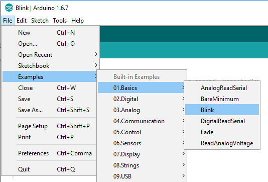

# P02: Ticket Tracker 

**Author(s)**: John Martin, Aaron Christson, Lakshiya Indreswaran, and Rofy Ray

*Google Document*: https://docs.google.com/document/d/1V5N-4NouEUfvDezkXH5lArIH8y42cbMOIZle4GVud_w/edit?usp=sharing
---
## Purpose

The Theater department has been keeping track of their tickets by hand for a long time. We know that this is often inefficient, and inaccurate. We are hoping to use an embedded system to help them record ticket trends, as well as to make tickets electronically or physically. 

## Initial Design Plan

-Raspberry Pi or Arduino

-ETEKJOY USB 3-Track Magnetic Stripe Card Reader, POS Credit Card Reader Swiper, MagStripe Swipe Card Reader ET-MSR90 
https://www.amazon.com/ETEKJOY-3-Track-Magnetic-Stripe-MagStripe/dp/B01N4L19CR

-THERMAL RECEIPT PRINTER GUTS (can be replaced by text message or email)
https://www.adafruit.com/product/2753?gclid=CjwKCAjwqLblBRBYEiwAV3pCJqJ9Z-Jb5PTlz0TFcmZE-3NG65DisyA5k5aAfUEgbkX2h4EVbqHaOBoCdjEQAvD_BwE

**NOTE**: Your initial design plan may not fully reflect your final product,
as projects evolve over time.

### Hardware Design
- List the hardware components you'll be using, and how they interact. 

This is an appropriate place for a diagram. An EXCELLENT resource 
for creating diagrams is the [Fritzing website](http://fritzing.org/home/ "Fritzing website")

**Sample image (to be removed)**:

### Software Design
- List all of the classes and functions you'll be creating.
  - Your program must follow good coding standards. 
  Primarily, I mean your code should include meaningful functions 
  and appropriate variables, and be formatted and commented well. 
  - If your programming language supports classes use them. *Classes are expected* to be well-designed and used throughout, if possible.
  - Sloppy code with no structure will be penalized. 

This is an excellent place for a CRC card or two.

### Data Design  

  The device will save data that are being input by the users. These data will be then used to generate the ticket. Name of the customer who is buying the ticket and  the classification they belong to are the inputs that we get from the user. We also have Identification number that is generated by the system for each tickets. These ID numbers are used to generate Bar code. When the ticket is scanned, the Ticket ID will be saved in an excel file. The data is saved whenever a qa customer buys a ticket and the whenever the ticket is being scanned.
   
  
 

A sample (i.e., table) of the data would likely make this section clearest.

### Additional Requirement
- Project 3 requires an additional requirement. Describe what additional component you will take on here. 
Thoroughness is encouraged! Explain how your addition moves the project closer to "final product". 
Pictures always help, too.

## Delegation of Tasks

- John Martin: Will work on getting card scanner to create ticket 

- Rofy Ray: Will work on making card scanner to send the ticket 

- Aaron Christson: will work on finding trends in ticket collection based on needs of the department

- Lakshiya Indreswaran: Will work on infrared implementation for counting tickets

## Files

N/A

## Instructions
Explain how to use your product. 
This section should THOROUGHLY describe its usage (i.e., more than just "Push start").

## Errors and Constraints
*You'll complete this part at the end of the project.*

Every program has bugs. Use this section to create a bullet list of
all known errors and deficiencies that remain in your product. 
Also, list any constraints that must exist for your product to work 
(e.g., Only works in low light situations).

## References

- https://www.youtube.com/watch?v=9FxlQXuXxFU : how to get card scanner to work with actual cards 

- https://www.raspberrypi.org/forums/viewtopic.php?t=69286 : how to send txt sms on Raspberry pi

- https://raspberry-projects.com/pi/software_utilities/email/ssmtp-to-send-emails : how to send email with Raspberry pi 

- https://learn.adafruit.com/adafruits-raspberry-pi-lesson-3-network-setup/finding-your-pis-ip-address : helps us to find the pi's IP 

- https://www.raspberrypi.org/forums/viewtopic.php?t=180370 : shows how to print using cups

- https://www.howtogeek.com/169679/how-to-add-a-printer-to-your-raspberry-pi-or-other-linux-computer/https://www.howtogeek.com/169679/how-to-add-a-printer-to-your-raspberry-pi-or-other-linux-computer/ : shows us how to print using CUPS

- https://www.rs-online.com/designspark/building-a-pi-powered-wireless-label-printer :  How to add brother QL printer to raspberry Pi
  
- https://github.com/pklaus/brother_ql_web :  Brother QL

- https://www.rs-online.com/designspark/building-a-pi-powered-wireless-label-printer : how to set up QL  printer 

## Summary and Reflection
*You'll complete this part at the end of the project.*

Write 3 - 5 paragraphs on your reactions to the final project. 
Your reflection should be thoughtful and reflective. 
First, report on what you did. Then, reflect on those actions. 
It's a look back at what you learned by doing this project, but good and bad. 
You should be critical of shortcomings (yours, as well as the instructors/assignments) 
as well as celebratory of what was achieved.

## Final Self-Evaluations
*You'll complete this part at the end of the project. 
Assign points to each team member in each category, based on their contribution to the team. 
The sum of all member's points in each category cannot exceed 10. 
For example, for Coding, Partner 1 could get 7 points, and Partner 2 gets 3 points. 
You can't give both people 6 points each though, as the sum exceeds 10.

### Ideation, Brainstorming, Design:

*Partner 1 Aaron Christson: 0-10*

*Partner 2 Raymond Okyere Forson: 0-10*

*Partner 3 Lakshiya Indreswaran: 0-10*

*Partner 4 John Martin: 0-10*

### Physical wiring/construction: 

*Partner 1 Aaron Christson: 0-10*

*Partner 2 Raymond Okyere Forson: 0-10*

*Partner 3 Lakshiya Indreswaran: 0-10*

*Partner 4 John Martin: 0-10*

### Code creation/debugging/integration: 

*Partner 1 Aaron Christson: 0-10*

*Partner 2 Raymond Okyere Forson: 0-10*

*Partner 3 Lakshiya Indreswaran: 0-10*

*Partner 4 John Martin: 0-10*

### Documentation:

*Partner 1 (replace this with your name): 0-10*

*Partner 2 (replace this with your name): 0-10*

*Partner 3 (replace this with your name): 0-10*

*Partner 4 (replace this with your name): 0-10*

### Leadership, Teamwork, & Participation:

*Partner 1 Aaron Christson: 0-10*

*Partner 2 Raymond Okyere Forson: 0-10*

*Partner 3 Lakshiya Indreswaran: 0-10*

*Partner 4 John Martin: 0-10*

---
**A Note from Scott to You**

While I expect this project to be challenging, one
thing to keep in mind is HAVE FUN with it! Create a product that
expresses your personal interests. Break up the writing so it’s not so burdensome.
We will have a live demo sessions at the end of the project to celebrate your accomplishments.
