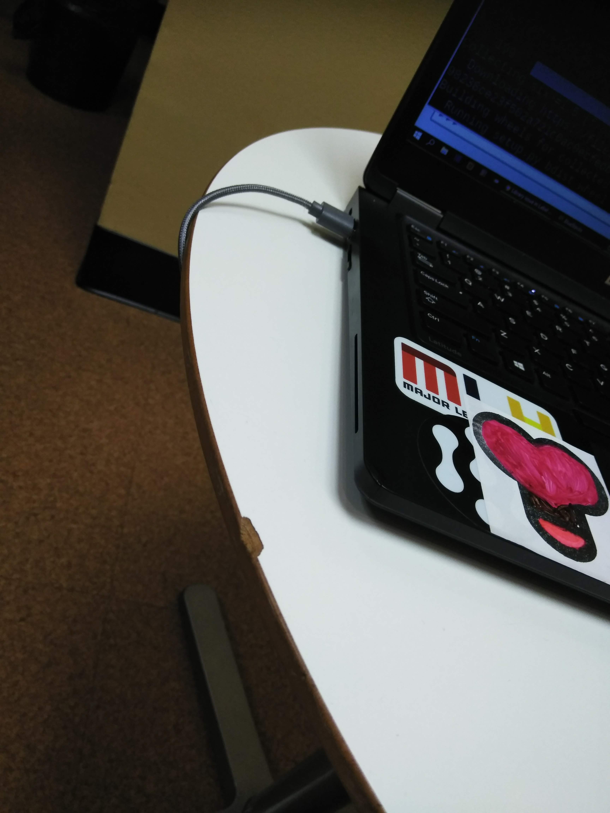
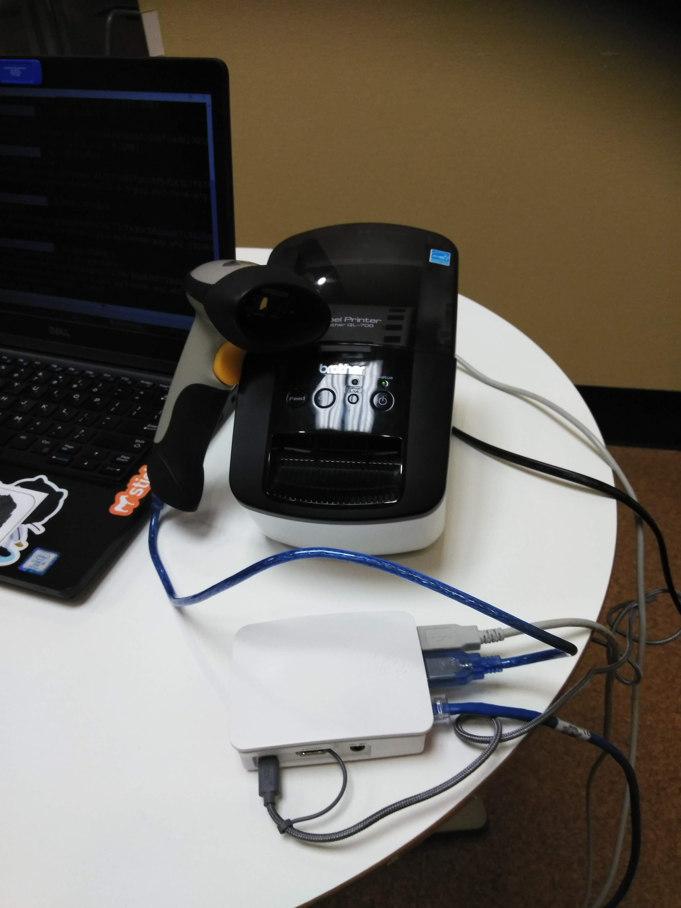
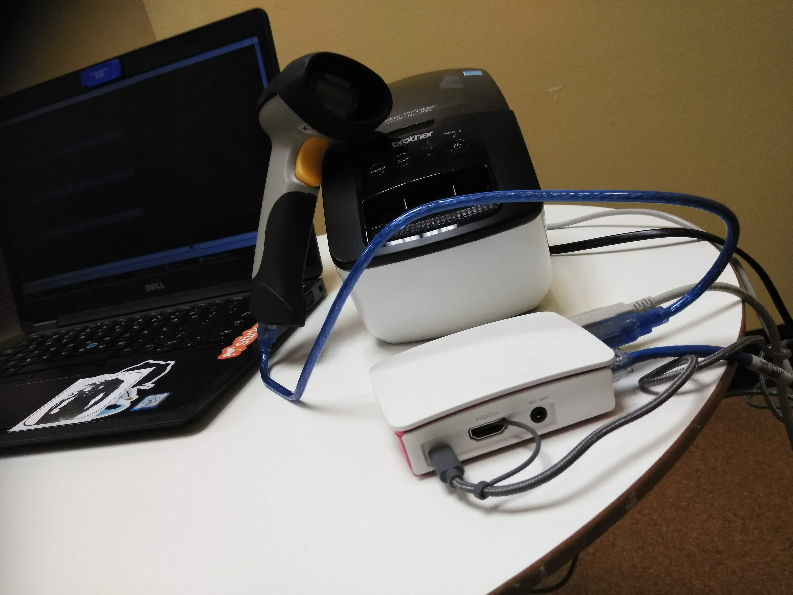
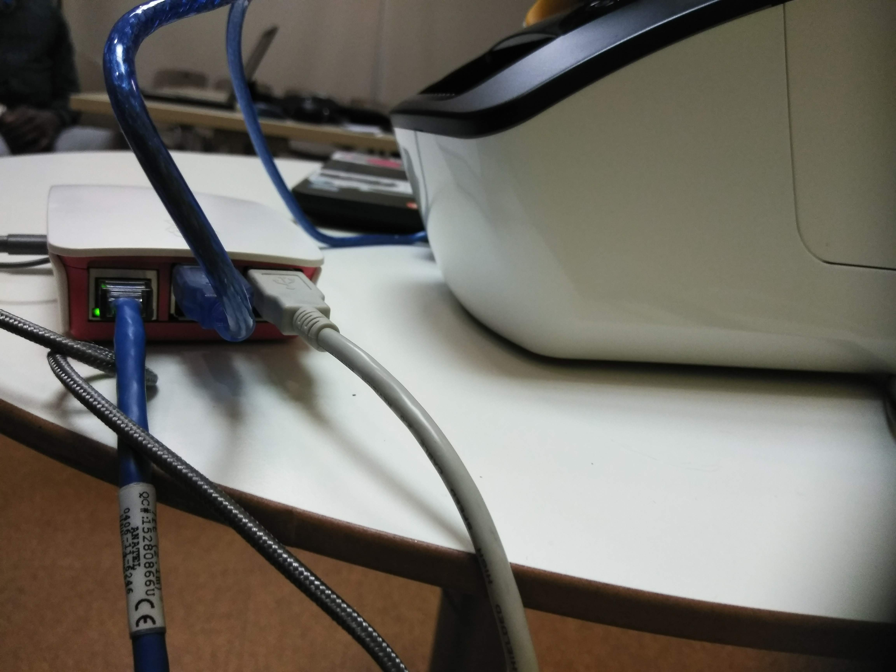
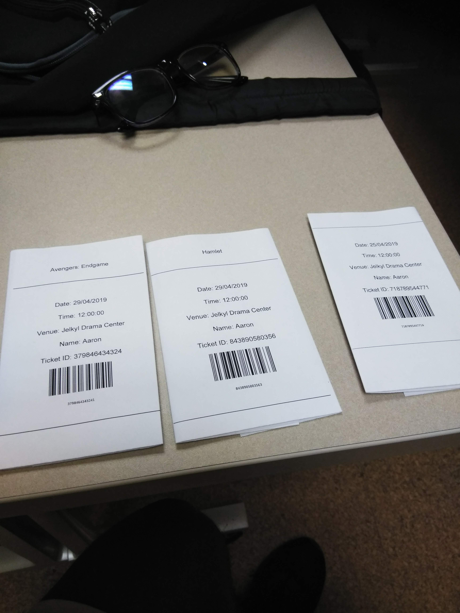

# P02: Ticket Tracker 

**Author(s)**: John Martin, Aaron Christson, Lakshiya Indreswaran, and Rofy Ray

*Google Document*: https://docs.google.com/document/d/1V5N-4NouEUfvDezkXH5lArIH8y42cbMOIZle4GVud_w/edit?usp=sharing
---
## Purpose

The Theater department has been keeping track of their tickets by hand for a very long time. We know that this is mostly inefficient, and and can lead to a lot of inaccuracy. This was confirmed by the department chair when she asked if something could be done about the situation currently at hand. As a result, we are seeking to build an embedded system that will help them record ticket trends, as well as create tickets electronically, which they can then print physically. 

## Initial Design Plan

The initial plan is to be able to write a python script that the Raspberry Pi can execute. The script will provide the user with a menu that will allow them to purchase a ticket based on their status as well as the number of total tickets they need. The status of the customer or user determines the price of the ticket and also allows the theater department to keep records of the ticket classification and trends. After the necessary information is collected through the options provided in the script, they are then put together to make an electronic ticket. The electronic ticket is then saved and printed into an actual ticket.

### Hardware Design
- List the hardware components you'll be using, and how they interact. 

* Inateck Barcode Scanner: scans the unique barcode generated on the physical ticket to check if ticket is valid
* Brother QL-700 Label Printer: prints the physical ticket when ready
* Raspberry Pi: acts as the central sytem to which the scanner and printer will be hooked. this also executes the ticket program

- This is how to set up the Raspberry Pi

### Software Design
- in the ticktet_maker file  
  - get_cust_name(): Function that takes input of coustomers name
  - get_number_of_tickets(): Function that takes input of number of tickets 
  - num_tickets: Function that ask for number of tickets being made
  - mainmenu(): Function that gives menu of options for coustomer to use 
  - opt = options(): Function that thakes in the option chosen form the mainmenu above
  - amount_lis = []: list that holds prices for each ticket 
  - ticket_amt = get_ticket_amount(opt): takes in the price  of ticket based on option entered
  - amount_list.append(ticket_amt): list that takes in the number of tickets needed 
  - create_csv(): Creates CSV that takes in the data on the ticket
  - ranum = samp_num(): Generates random number for bar code
  - generate_barcode(): Generates Barcode 
  - make_tix: Function that makes the ticket 
  - enter_csv(customername, opt, ticket_amt, bar_num): Function that inters coustomer name, opt, ticket amt, and barcode number into the CSV 

- In the ticket_scanner file
  - create_scanned_csv(): function that creates the CSV file holding the tickets barcode numbers
  - add_to_csv(): adds scanned Barcode to CSV file
  - Check_valid(): function that checks if the scanned Barcode Matches any barcode in the file already
   
### Data Design  

  The device will save data that are being input by the users. This data will then be used to generate the ticket. Name of the customer who is buying the ticket and  the classification they belong to are the inputs that we get from the user. We also have Identification number that is generated by the system for each ticket. These Identification numbers are used to generate a bar code which will be used when the ticket is being scanned. The Ticket ID will be saved in an excel file. These data are saved whenever a customer buys a ticket and the whenever the ticket is being scanned.
   

### Additional Requirement
- We printed a ticket. This brings us one step closer to a finished project, because the implementation of printing a ticket is something you would see in an Theater.

## Delegation of Tasks

- John Martin: Work on the printer. 

- Rofy Ray: Work on making the code to produce the ticket.

- Aaron Christson: Work on making the code to produce the barcode.

- Lakshiya Indreswaran: Work on connecting printer with John. 

## Files

ticket_maker.py : It contains the main code for creating the ticket with bar code

tickte_scanner.py: Contains the code that scans and compares the ticket to the CSV file

Barcode_test.py :  Initial code for creating barcode

Qrcode_test.py : Code for creating a QR code

## Instructions
- user will need to install VNC on their computer 
- user will need a mouse, keyboard, ethernet cord and a screen, and follow the instructions on this website https://www.raspberrypi.org/documentation/remote-access/vnc/
- user then needs to run the program 
- enter the information provided
- A ticket will be printed 
- Scan ticket night of the performance 
- The scanner should say if the ticket scanned is valid or not

## Errors and Constraints
- Printing: 
  
  - Printing the ticket using a printer was the difficult part.  We have had problem in using the rapberry pi to print the documents. We were able to intsall CUPS library but for the Lexmark printer it gave an error message "Printer is not responding" and for brother QL700, it showed the printing job is completed but it did not print anything. We tried to use brother QL ppd directly to print the ticket and we were able to print via brother QL printer using raspberry Pi but the only problem was the library allows us to only print images in png format. The ticket we have created is in PDF. Thus it does not allow us to print the ticket. We tried different ways to convert pdf to image but it was harder than we thought. The libraries were complicated and we still have issues in converting pdf to image. Our solution to this problem is to print through VNC server installed in the laptop. 

- We could not make the GUI for the user to easily input the ticket information

- We did not test the code on the pi soon enough, and there were a lot of things that needed to be installed last minute.

## References

- https://www.youtube.com/watch?v=9FxlQXuXxFU : how to get card scanner to work with actual cards 

- https://www.raspberrypi.org/forums/viewtopic.php?t=69286 : how to send txt sms on Raspberry pi

- https://raspberry-projects.com/pi/software_utilities/email/ssmtp-to-send-emails : how to send email with Raspberry pi 

- https://learn.adafruit.com/adafruits-raspberry-pi-lesson-3-network-setup/finding-your-pis-ip-address : helps us to find the pi's IP 

- https://www.raspberrypi.org/forums/viewtopic.php?t=180370 : shows how to print using CUPS

## Summary and Reflection
   We have done a good job in creating a tiket for the theatre department. We created a unique ticket and are able to print it. This project showed us all that we should be prepared for anything. It takes a lot of asking the department what they were looking for in the embedded system, and narrowing our idea down to something manageable. It also took discussing what each individual had learned, and how to apply it to the project. We had gotten the Ql-700 printer to work at one point, but then, the SD card that of the pi which we used to print the ticket stopped working. We have tried the same code in various pi, it created the same proble.  In order to fix this we decided to print from the vnc using CUPS. The great thing is that we are able to make a ticket that can be scanned and printed.

  We have created a ticket with bar code. Ticket will have th name of the person who bought the ticket and the bar code. once the bar code is scanned, the program will check whether or not the ticket is valid. Everytime a ticket is scanned, it will be saved in a csv file and it will help them to find out how many people have attended the event. However, we did forget to test on the Pi until the night before. It seems as if there is a problem with the Barcode module, which hinders the Pi from running the code. 
  
  It gives us an import error, and we have installed multiple barcode libraries. The great thing is we have all of the working parts, the bad thing is that these parts are not completely together. Hopefully we can rise to the ocassion, but there is not that much time left. The solution to this would probably have been better communication. Hopefully we have something great. 

## Final Self-Evaluations

### Ideation, Brainstorming, Design:

*Aaron Christson: 2.5

*Raymond Okyere-Forson: 2.5

*Lakshiya Indreswaran: 2.5

*John Martin: 2.5

### Physical wiring/construction: 

*Aaron Christson: 2.5

*Raymond Okyere-Forson: 2.5

*Lakshiya Indreswaran: 2.5

*John Martin: 2.5

### Code creation/debugging/integration: 

*Aaron Christson: 2.5

*Raymond Okyere-Forson: 2.5

*Lakshiya Indreswaran: 2.5

*John Martin: 2.5

### Documentation:

*Aaron Christson: 2.5

*Raymond Okyere-Forson: 2.5

*Lakshiya Indreswaran: 2.5

*John Martin: 2.5

### Leadership, Teamwork, & Participation:

*Aaron Christson: 2.5

*Raymond Okyere-Forson: 2.5

*Lakshiya Indreswaran: 2.5

*John Martin: 2.5

---

